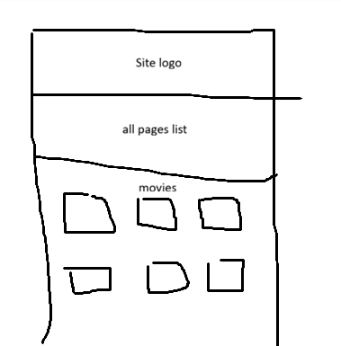

Chapter 2 – User Interface
Information Organization

The website follows a simple and intuitive structure. Information is divided into four main pages:

Home
Suggested Songs
Pricing
Help

The navigation menu is available on every page, allowing users to move easily between sections.

The Home page presents movie recommendations and provides access to the XML document.

The Suggested Songs page displays songs associated with each movie.

The Pricing page contains subscription plans and pricing information.

The Help page includes frequently asked questions and a contact form.

Responsive Design

The website was developed using a mobile-first responsive approach.

The layout automatically adapts to different screen sizes through CSS media queries.

On smaller screens, movie cards are displayed in fewer columns, while navigation elements are reorganized for better usability.

Sketch

Figure 1 – Initial sketch of the website structure.

Wireframe

Insert your wireframe image below.

Figure 2 – Wireframe used during the planning phase.

Sitemap
Home
│
├── Suggested Songs
├── Pricing
└── Help

Figure 3 – Website sitemap.

Final Interface

The final interface follows the original wireframe design.

The website uses a dark color palette, movie posters, interactive cards, responsive layouts and clear navigation menus to improve the user experience.